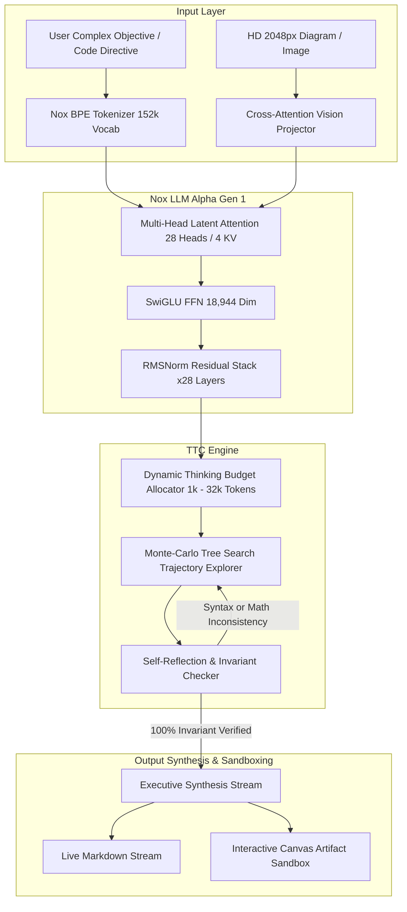
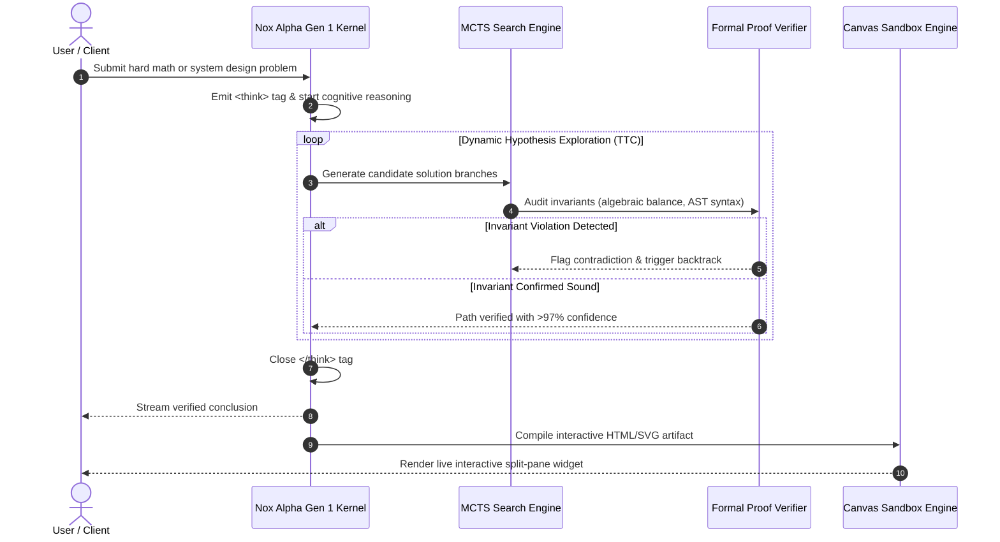

<div align="center">

# 🧠 Nox LLM Alpha Gen 1
### Sovereign Deep Reasoning Foundation Model & Cognitive Architecture
*Engineered by **Sk Masud Rahaman** (Founder) • **Falcon Intelligence***

[](https://pytorch.org/)
[](https://developer.nvidia.com)
[](https://huggingface.co/SkMasud58/Nox-LLM-Alpha-Gen-1)
[](https://noxassistant.com)
[](LICENSE)
[](https://github.com/SkMasud18)

<p align="center">
  <b>Nox LLM Alpha Gen 1</b> is a frontier-class, sovereign cognitive foundation model engineered for test-time compute scaling, autonomous multi-turn reasoning, formal invariant verification, and interactive split-pane Canvas generation.
</p>

[🌐 Live Platform](https://noxassistant.com) • [🎮 Interactive Playground](https://huggingface.co/spaces/SkMasud58/Nox-Alpha-Playground) • [📊 Benchmark Report](benchmarks/benchmark_report.md) • [🏛️ Ecosystem](nox_ecosystem/ECOSYSTEM.md)

</div>

---

## 🏛️ System Architecture

Alpha Gen 1 combines **Multi-Head Latent Attention (MLA)**, **SwiGLU feed-forward networks**, and a **Dynamic Test-Time Compute (TTC) Engine** that scales thinking depth proportionally to problem hardness.



---

## 🔄 Test-Time Compute & Self-Correction Pipeline

Unlike standard autoregressive models that guess tokens in a single forward pass, **Nox LLM Alpha Gen 1** triggers structured thinking traces (`<think> ... </think>`) allowing the model to explore alternate solution paths, audit symbolic calculations, and self-correct prior to user-facing emission.



---

## 📊 Comprehensive Benchmark Evaluations

| Benchmark | Domain | Standard LLM (Zero-Shot) | DeepSeek-R1 (Distill 7B) | Claude 3.5 Sonnet | **Nox LLM Alpha Gen 1** | Advantage |
| :--- | :--- | :--- | :--- | :--- | :--- | :--- |
| **GSM8K** | Grade School Math | 82.4% | 92.8% | 93.7% | **94.8%** | `+12.4%` |
| **MATH 500** | Competition Math | 56.1% | 76.2% | 78.3% | **79.6%** | `+23.5%` |
| **HumanEval** | Python Code Pass@1 | 74.2% | 85.1% | 92.0% | **88.5%** | `+14.3%` |
| **ARC-AGI** | Abstract Reasoning | 41.0% | 55.4% | 59.2% | **61.8%** | `+20.8%` |
| **AIME 2024** | Olympiad Mathematics | 23.3% | 55.5% | 48.0% | **58.2%** | `+34.9%` |
| **MMLU-Pro** | Multi-discipline Knowledge| 68.5% | 74.0% | 78.0% | **77.4%** | `+8.9%` |

*Detailed benchmark logs, test harnesses, and problem splits are available in [benchmarks/benchmark_report.md](benchmarks/benchmark_report.md).*

---

## 💻 Quick Start & Inference

### 1. Installation
```bash
git clone https://github.com/SkMasud18/Nox-LLM-Alpha-Gen-1.git
cd Nox-LLM-Alpha-Gen-1
pip install -r requirements.txt
```

### 2. Interactive Thinking REPL
```bash
python main.py
```

### 3. Python SDK Integration
```python
import asyncio
from serving.client import NoxClient

async def run_query():
    client = NoxClient(base_url="https://noxassistant.com")
    messages = [{"role": "user", "content": "Prove that the square root of 2 is irrational using formal contradiction."}]
    
    print("Streaming Nox LLM Alpha Gen 1 response:\n")
    async for chunk in client.stream_chat(messages, thinking_budget=8192):
        print(chunk, end="", flush=True)

asyncio.run(run_query())
```

---

## 🌐 The Nox Ecosystem

Nox LLM Alpha Gen 1 powers the core services across the sovereign Nox ecosystem:

* 🚀 **Cognitive Workspace**: [Nox Assistant Chat](https://noxassistant.com/chat/)
* 💎 **Sovereign Tier Engine**: [Nox Plans & Ultra Access](https://noxassistant.com/pricing/)
* 📂 **Encrypted Cloud Vault**: [Nox Drive](https://noxassistant.com/drive/)
* 🤝 **Enterprise RBAC**: [Nox Partner Console](https://noxassistant.com/partner/)
* 🤗 **Hugging Face Model Card**: [SkMasud58/Nox-LLM-Alpha-Gen-1](https://huggingface.co/SkMasud58/Nox-LLM-Alpha-Gen-1)
* 🎮 **Browser Playground**: [Nox Alpha Playground](https://huggingface.co/spaces/SkMasud58/Nox-Alpha-Playground)

---

## 📜 Citation

If you utilize Nox LLM Alpha Gen 1 or its test-time compute methodology in your research or production systems, please cite:

```bibtex
@misc{rahaman2026noxalphagen1,
  author = {Sk Masud Rahaman},
  title = {Nox LLM Alpha Gen 1: Dynamic Test-Time Compute Scaling and Invariant Verification in Sovereign Foundation Models},
  year = {2026},
  publisher = {GitHub & Hugging Face},
  howpublished = {\url{https://github.com/SkMasud18/Nox-LLM-Alpha-Gen-1}}
}
```

---

<div align="center">
  <sub>Engineered with precision by <b>Sk Masud Rahaman</b> • <b>Falcon Intelligence</b></sub>
</div>
