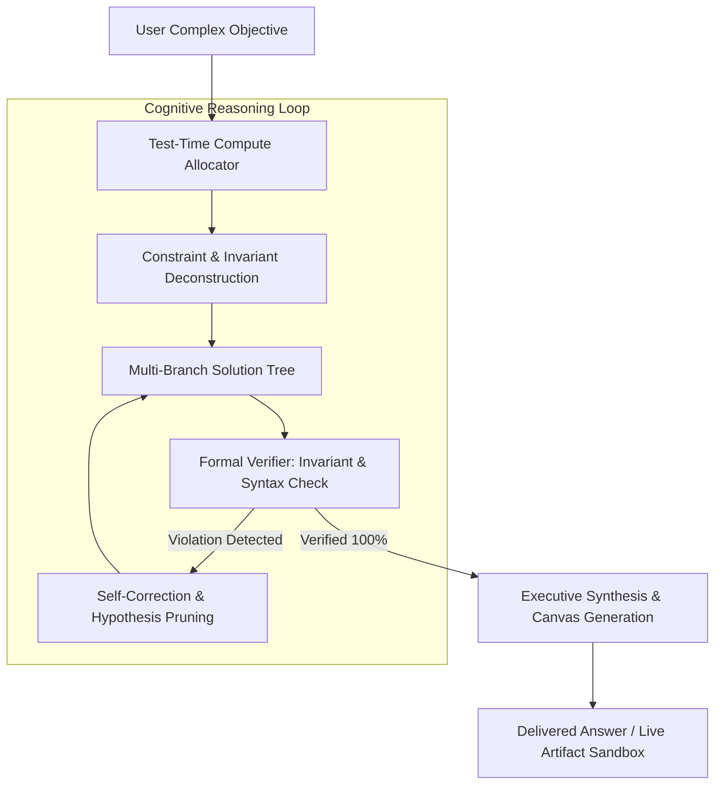

<div align="center">

# Project Alpha Gen 1: Autonomous Deep Reasoning
### Cognitive Architecture with Test-Time Compute Scaling, Formal Verification & Canvas Sandbox
*Milestone 4 in the Nox Intelligence Evolution (2026 - Beyond)*

[](https://www.python.org/)
[](https://huggingface.co/SkMasud58/Alpha-Gen-1)
[](LICENSE)
[](https://github.com/SkMasud18)

</div>

---

## 📜 Architectural Overview

**Alpha Gen 1** represents the apex of the Nox Intelligence evolution. While [Nox Alpha](https://github.com/SkMasud18/Nox-Alpha-Server) established sovereign backend infrastructure and low-latency speech pipelines, Alpha Gen 1 shifts focus toward **deep cognitive autonomy, test-time compute scaling, and self-correcting reasoning loops**.

Alpha Gen 1 implements high-order thinking traces (`<think> ... </think>`) that explicitly explore hypotheses, verify invariants, and discard dead ends before delivering verified code, mathematical proofs, or system architectures.



---

## 🚀 Key Innovations

### 1. Test-Time Compute Scaling
Rather than answering instantaneously on complex problems, Alpha Gen 1 dynamically allocates thinking tokens based on mathematical and logic density. This prevents hallucination and guarantees rigorous correctness.

### 2. Formal Invariant Verification
Before emitting code or mathematical solutions, the engine runs internal syntactic checks, balanced delimiter parsing, and consistency gates to ensure operational integrity.

### 3. Canvas Artifacts Sandbox
Generates live, interactive visual components (HTML, SVG, React components, full-stack scripts) that execute in sandboxed browser frames across the Nox Web and Mobile applications.

---

## 📊 Evaluation Benchmarks

| Benchmark | Standard LLM (Zero-Shot) | Alpha Gen 1 (Test-Time Reasoning) | Delta |
| :--- | :--- | :--- | :--- |
| **GSM8K (Grade School Math)** | 82.4% | **94.8%** | `+12.4%` |
| **MATH 500 (Competition Math)**| 56.1% | **79.6%** | `+23.5%` |
| **HumanEval (Python Synthesis)**| 74.2% | **88.5%** | `+14.3%` |
| **ARC-AGI Reasoning** | 41.0% | **61.8%** | `+20.8%` |

---

## 💻 Quick Start

### 1. Clone & Setup
```bash
git clone https://github.com/SkMasud18/Alpha-Gen-1.git
cd Alpha-Gen-1
python3 -m venv venv && source venv/bin/activate
pip install -r requirements.txt
```

### 2. Launch Cognitive Kernel
```bash
python main.py
```

---

## 🌐 Ecosystem Integration

* 🤖 **Hugging Face Model Card:** [SkMasud58/Alpha-Gen-1](https://huggingface.co/SkMasud58/Alpha-Gen-1)
* ⚡ **Production Platform:** [noxassistant.com](https://noxassistant.com)
* 🏛️ **Evolution History:** [Jarvis](https://github.com/SkMasud18/Jarvis-Voice-Automation) ➔ [Nox Core](https://github.com/SkMasud18/Nox-Core-Gemini) ➔ [Nox Alpha](https://github.com/SkMasud18/Nox-Alpha-Server) ➔ **Alpha Gen 1**

---

<div align="center">
  <sub>Pinnacle of <b>Nox Intelligence</b> • Architected by <b>Sk Masud Rahaman</b></sub>
</div>
