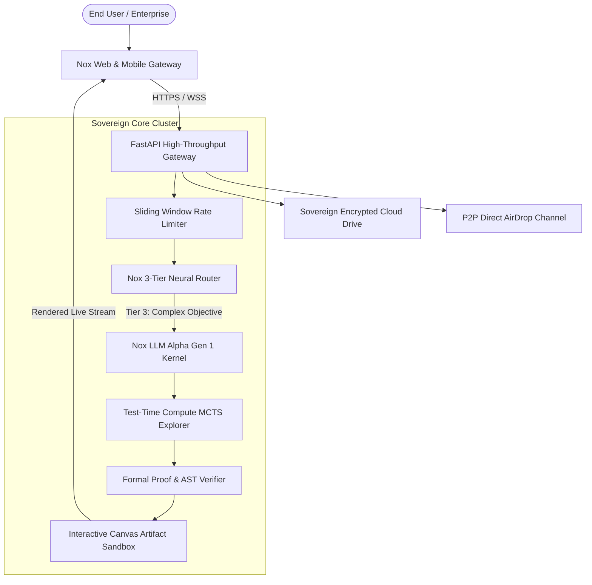

# 🌐 The Nox Intelligence Sovereign Ecosystem

**Nox LLM Alpha Gen 1** is the foundational cognitive intelligence powering the end-to-end Nox sovereign ecosystem, developed by **Sk Masud Rahaman** and **Falcon Intelligence**.

---

## 🏛️ Ecosystem Portals & Endpoints

| Platform Module | Direct Portal URL | Architecture & Purpose |
| :--- | :--- | :--- |
| **🚀 Nox Cognitive Chat** | [noxassistant.com/chat](https://noxassistant.com/chat/) | High-speed multi-modal chat interface with dynamic KaTeX LaTeX rendering, image lightboxes, and streaming responses. |
| **💎 Plan Architecture & Pricing** | [noxassistant.com/pricing](https://noxassistant.com/pricing/) | Sovereign tier engine (Free, Basic, Premium, Ultra with infinite compute masking and 120Hz smooth scrolling). |
| **📂 Sovereign Drive & Vault** | [noxassistant.com/drive](https://noxassistant.com/drive/) | Encrypted document repository with instant thumbnail generators, WebRTC P2P AirDrop transfers, and file management. |
| **🤝 Partner Console & RBAC** | [noxassistant.com/partner](https://noxassistant.com/partner/) | Glassmorphic enterprise sub-admin portal with granular Role-Based Access Control and session security. |
| **🤗 Hugging Face Foundation Model** | [SkMasud58/Nox-LLM-Alpha-Gen-1](https://huggingface.co/SkMasud58/Nox-LLM-Alpha-Gen-1) | Official public weights, model card, and architecture documentation. |
| **🎮 Interactive Live Playground** | [Nox-Alpha-Playground](https://huggingface.co/spaces/SkMasud58/Nox-Alpha-Playground) | Direct browser-based execution sandbox running against the real Nox Sovereign Neural Engine. |

---

## 🔄 End-to-End Enterprise Data Flow

---

  Architected by <b>Sk Masud Rahaman</b> • Falcon Intelligence

